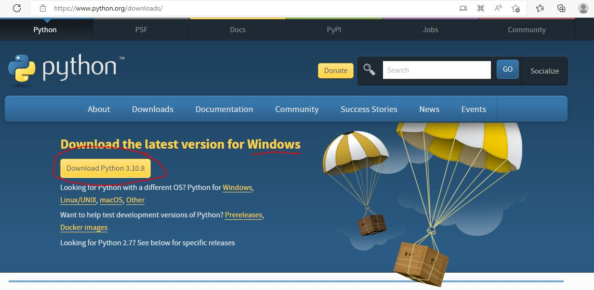
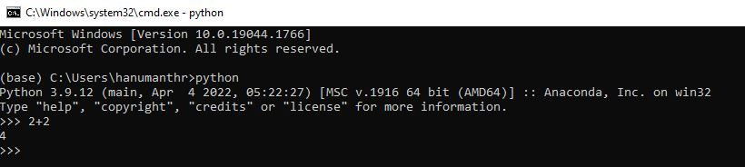
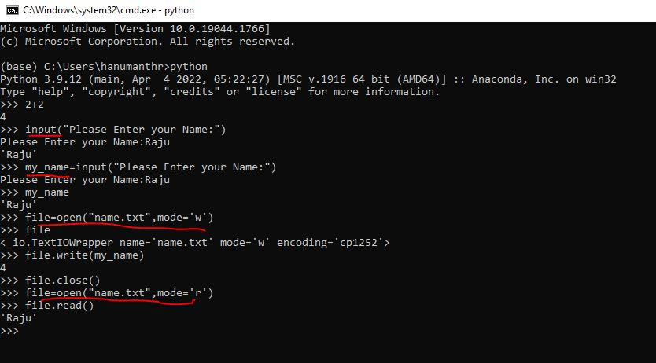
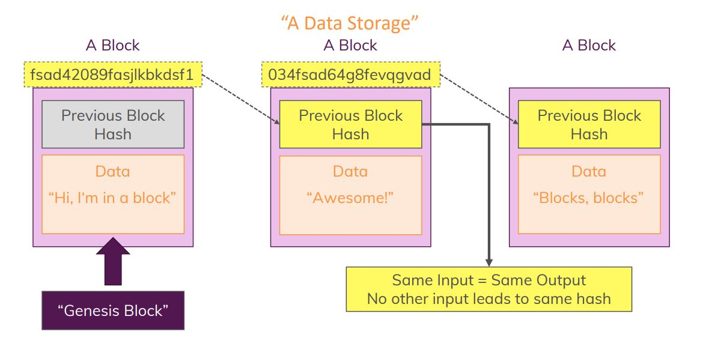
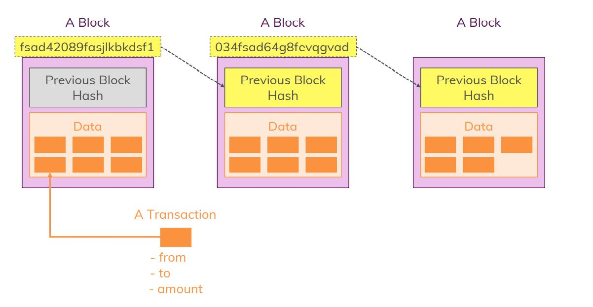
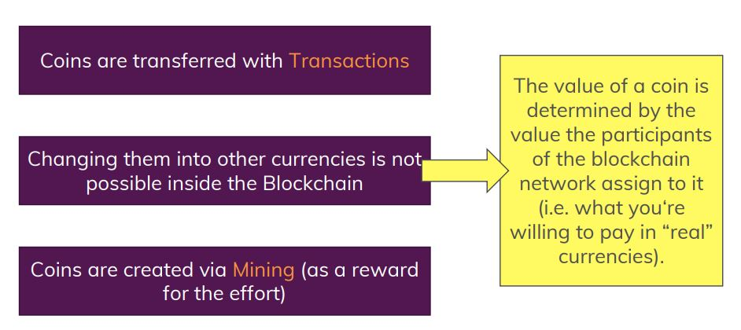
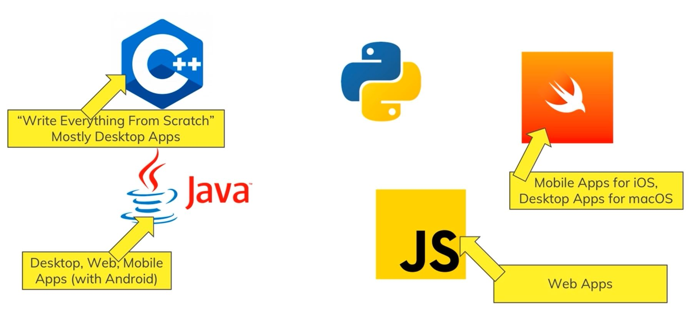

# Introduction

In this Course you will learn Python by building an entire Blockchain and your own Cryptocurrencies from the scratch. This course is about building a Blockchain project by using python features.

# Python Setup

Access the link: https://www.python.org/downloads/
Download the python version specific to Your Operating system and get it installed.

Once installed, open the command terminal and run the command as shown below, *>>>* describes you are in Python repository.

# What is Python
Python is a powerful, easy-to-use, object-oriented programming language.

**Powerful**: Its Performat, it runs on all OS and its extremely versatile.

**Versatility**: Scripts and Programs, Web Development (Server side code), Data Science

**Scripts and Programs**: Use it as a Calculator (Using command line), Write simple (utility) scripts or complex programs, add a UI to create a desktop applications

**Web development**: Use Python as a server side language, Build Full stack apps or REST APIs, Use frameworks like Django or Flask

**Data Science**: Use rich set of third pary packages, gather, import and clean data, Do Statstical analyses, plotting, Machine Learning

**Easy-to-Use**: clean and simple syntax, offers great documentation

**Object Oriented**: Embraces objects, classes, inheritance and allows you to easily work with complex data structures

# First Python Program

Uses **input()** to read data from user, stores it in a variable, also uses files to store the data and retrieve the data from file.

# What's a Blockchain

A distributed data storage consisting of containers (blocks) which are connected.

## What's Cryptocurrency?

If the data you store in a block is a list of transactions, the coins transferred in the transactions form your cryptocurrency.

## Where are the Coins?

## Blockchain Big picture

