# Loops and Conditionals: Repeat and Check

## Module Overview

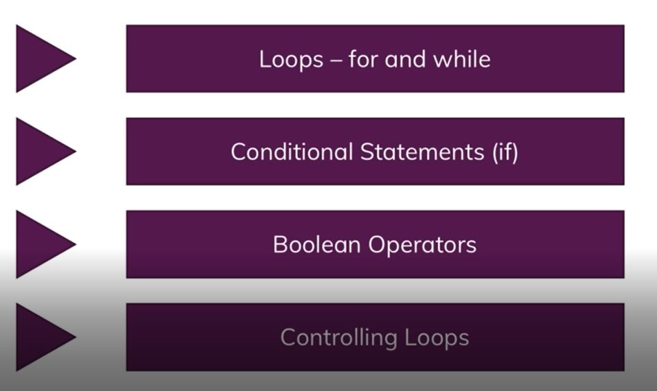

## Blockchain Overview

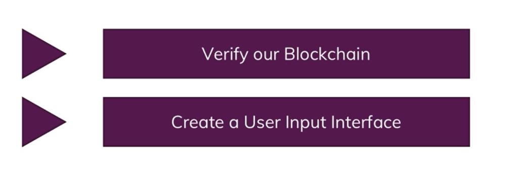

## Working with loops

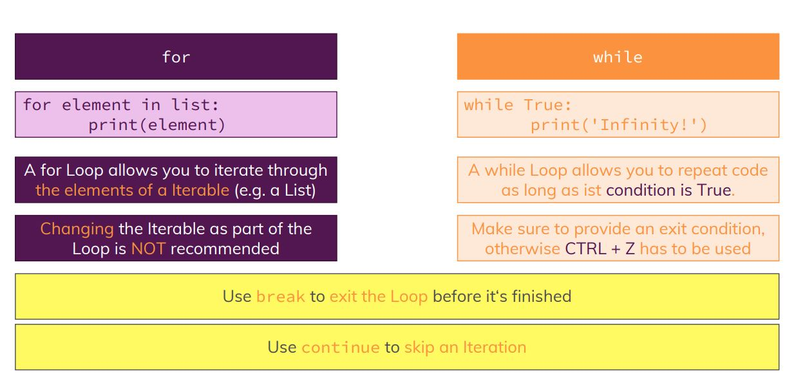

### Creating for loop
Refer to the loops-if-01-created-for-loop folder for the code

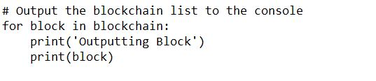

### Creating While loop
Refer to the loops-if-02-created-while-loop folder for the code

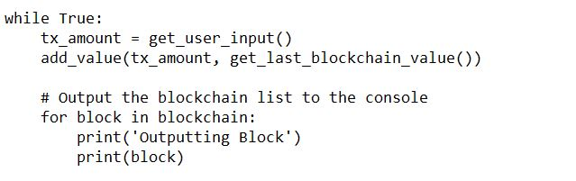

## Understanding Conditionals

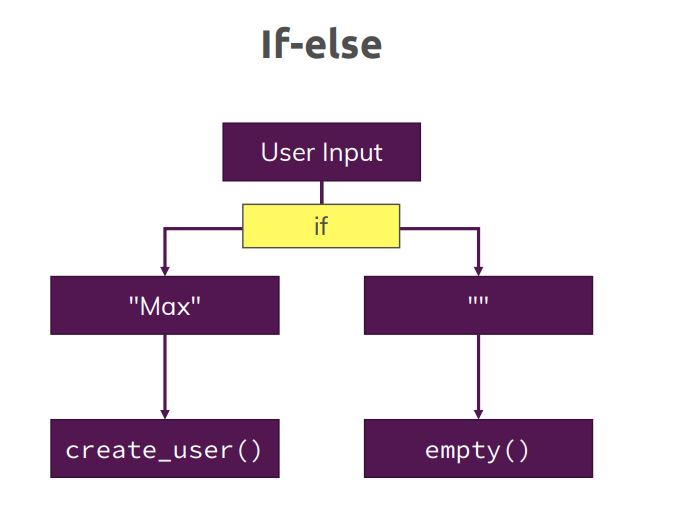

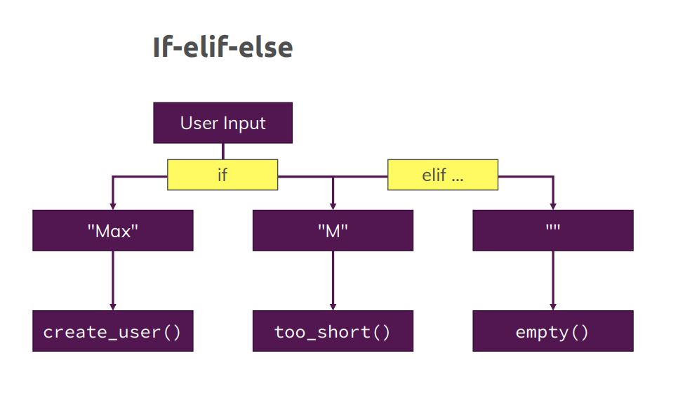

### applying if else

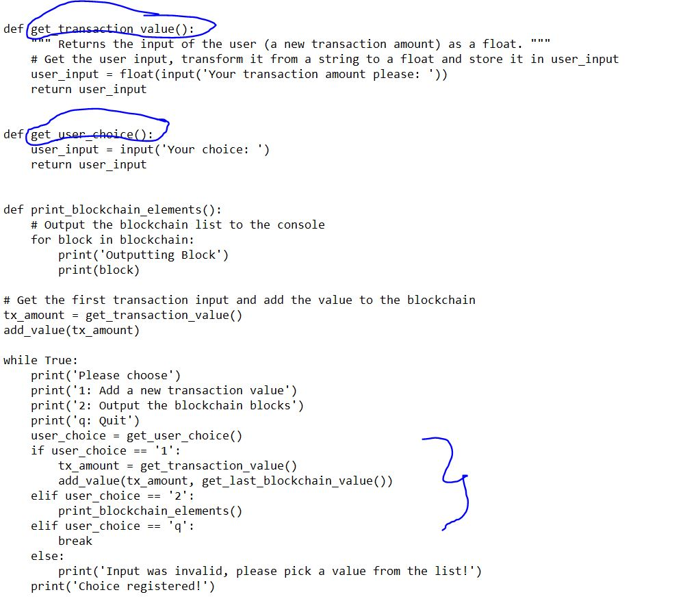

### Booleans

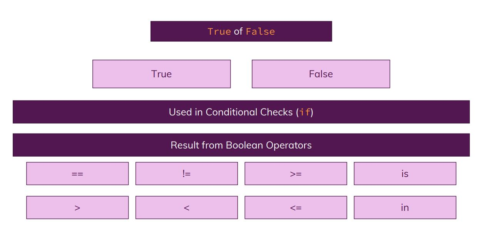

### adding elif

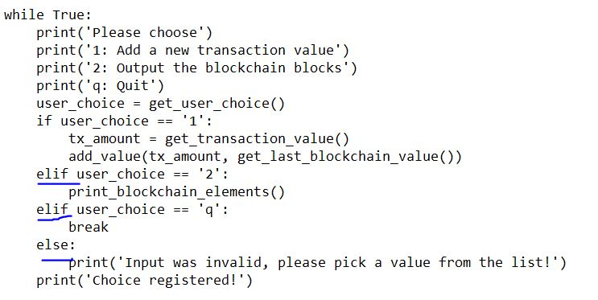

### Understanding break and continue

Refer to the loops-if-03-understanding-break-continue folder for the code

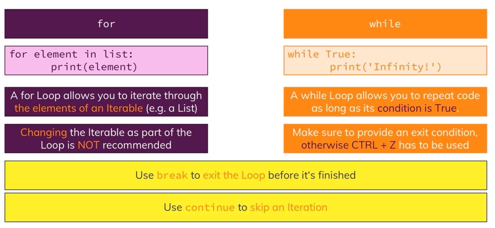

## Understanding is in 

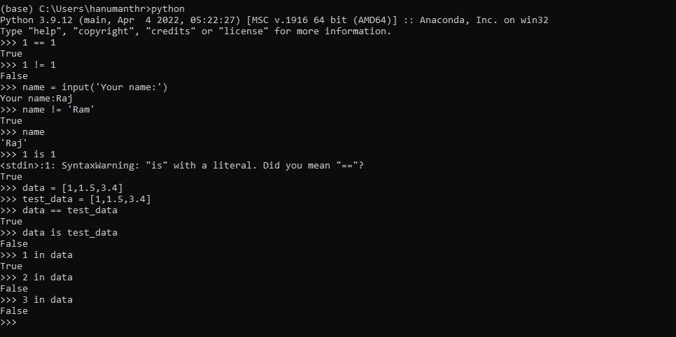

## the not keyword

## Working with and/or

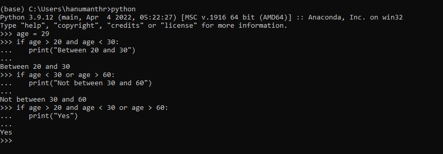

## Grouping conditionals

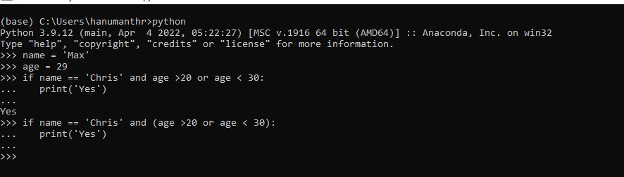

## Switch statements

There is no switch-case statement in python

## Verifying our blockchain

Refer to the loops-if-04-verifying-the-blockchain folder for the code

### Manipulating Blockchain

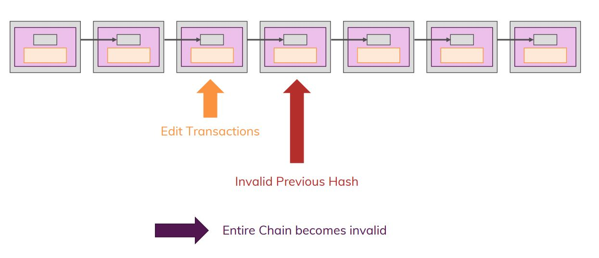

### Checking our Blockchain

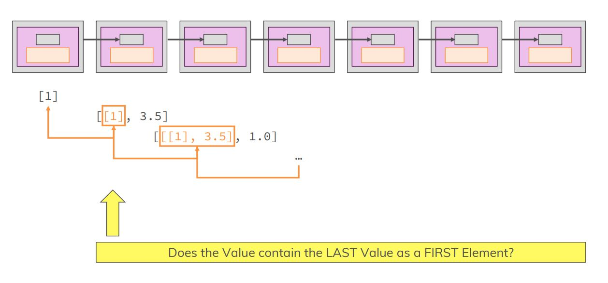

