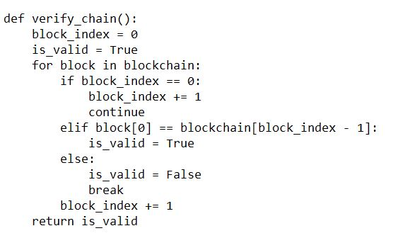
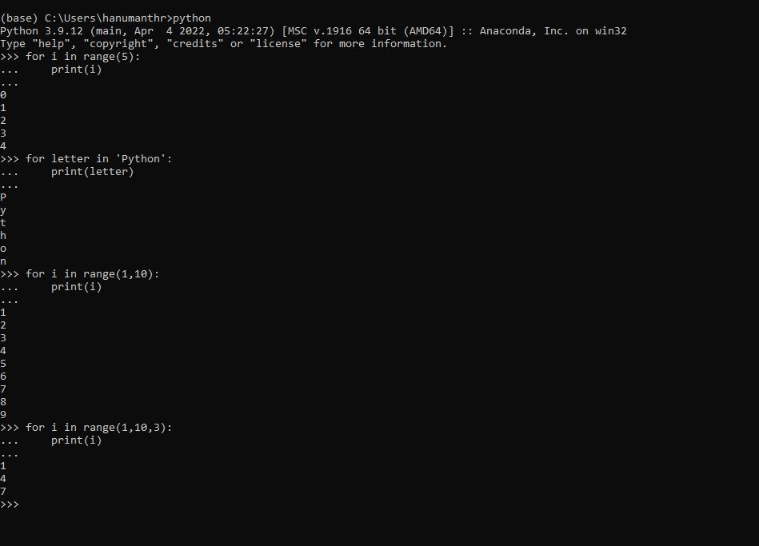
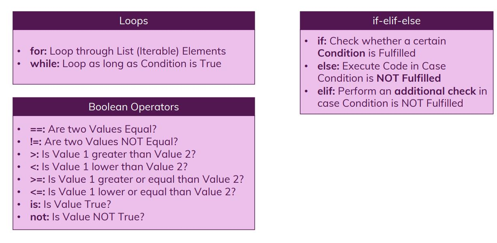
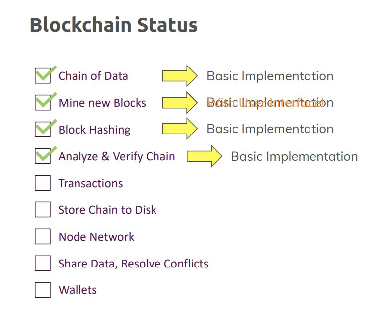

# Loops and Conditionals: Repeat and Check

## Module Overview

## Blockchain Overview

## Working with loops

### Creating for loop
Refer to the loops-if-01-created-for-loop folder for the code

### Creating While loop
Refer to the loops-if-02-created-while-loop folder for the code

## Understanding Conditionals

### applying if else

### Booleans

### adding elif

### Understanding break and continue

Refer to the loops-if-03-understanding-break-continue folder for the code

## Understanding is in 

## the not keyword

## Working with and/or

## Grouping conditionals

## Switch statements

There is no switch-case statement in python

## Blockchain Theory: Understanding Blockchain Verification

A core concept of the Blockchain technology is that individual Blocks should be connected. Each Block knows the Block coming prior to itself. So Block C knows Block B which in turn is aware of Block A.

What does "Know" mean though?

To ensure data integrity, a hash is calculated for each Block. We're not doing this yet but we'll add this functionality throughout the course.

For now, we simply store the complete value of Block B in Block C which then is stored in Block D - and so on.

This allows us to check whether a certain Block in the Blockchain still looks the way it looked like when the Block after it was added. So if we change Block B after we added Block C, Block C will recognize that because it saved a snapshot of Block B when it (=> Block C) was created.

This ensures that the Blockchain can't be manipulated by other users. If you change a value, the other Blocks coming after it will recognize that.

Of course, you could theoretically edit the entire Blockchain. We'll add more security mechanisms throughout the course to ensure that this also doesn't work. The relation between Blocks is a first important building block though.

## Verifying our blockchain

Refer to the loops-if-04-verifying-the-blockchain folder for the code

### Manipulating Blockchain

### Checking our Blockchain

## Adding range function

Refer to the loops-if-05-adding-range folder for the code

## Module Summary

# Useful Resources and Links

•	More on Loops: https://docs.python.org/3/tutorial/controlflow.html#for-statements

•	More on if Statements: https://docs.python.org/3/tutorial/controlflow.html#if-statements

