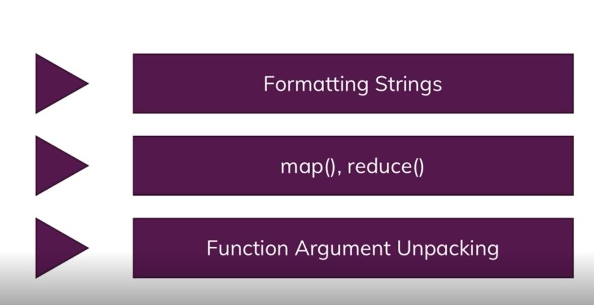
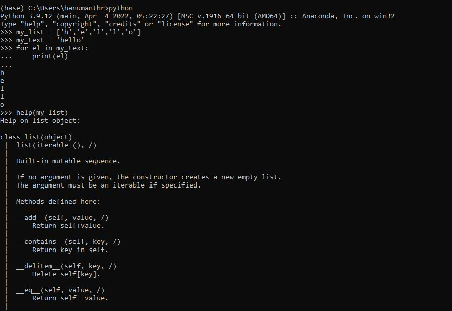
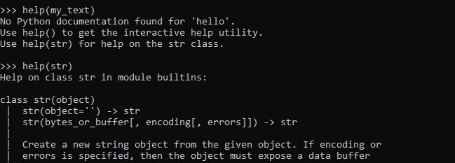
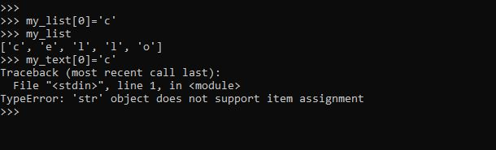
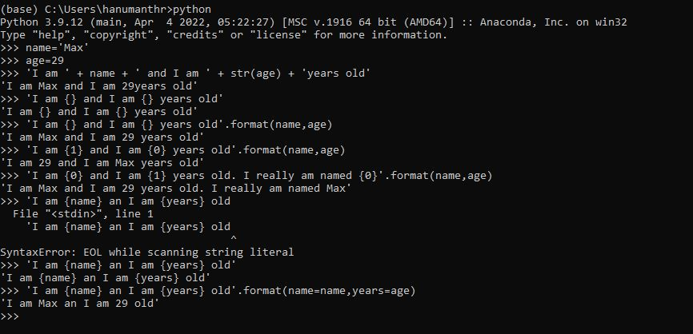
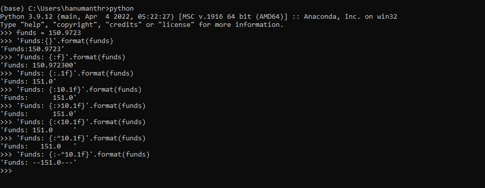
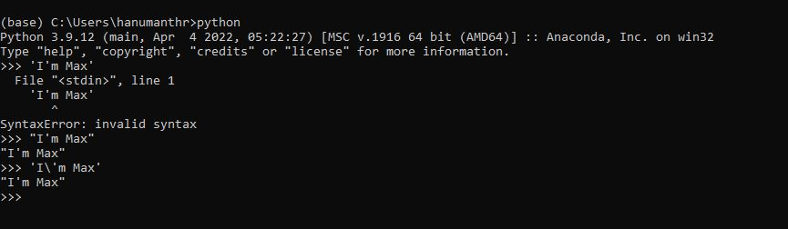
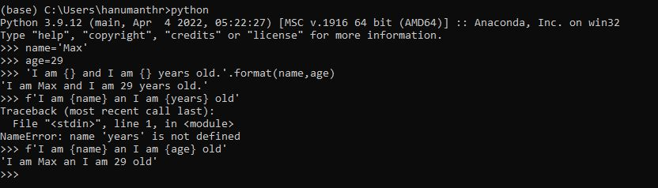
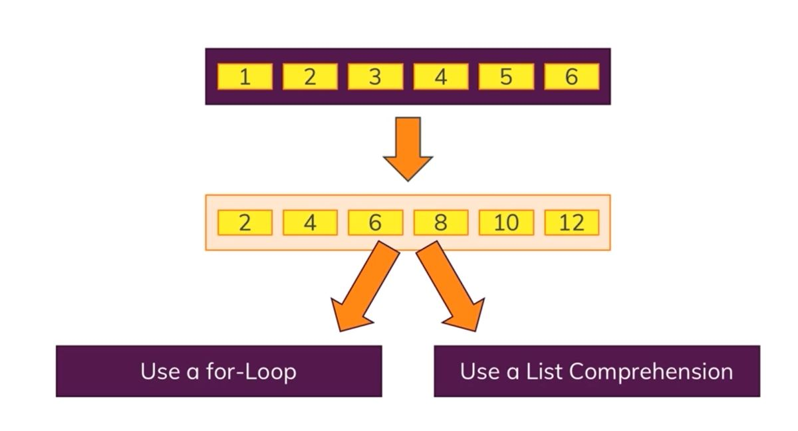

# More on Functions and Strings: Digging Deeper

## Module Overview

## What about Blockchain

## Comparing Strings and Lists

## Understanding the format method

## Escaping Character

## Formatting strings with f

## Adding string formatting to our project

change the print method is if not verify_chain() block

Refer to **blockchain1.py** file

