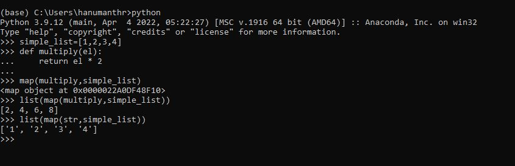
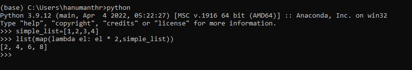
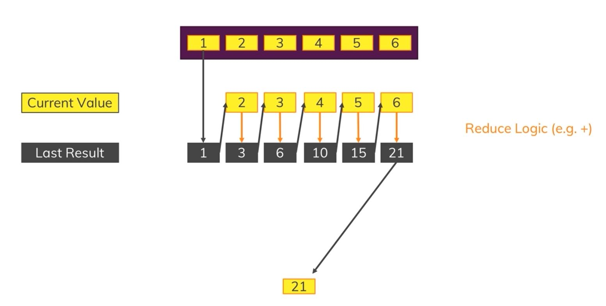
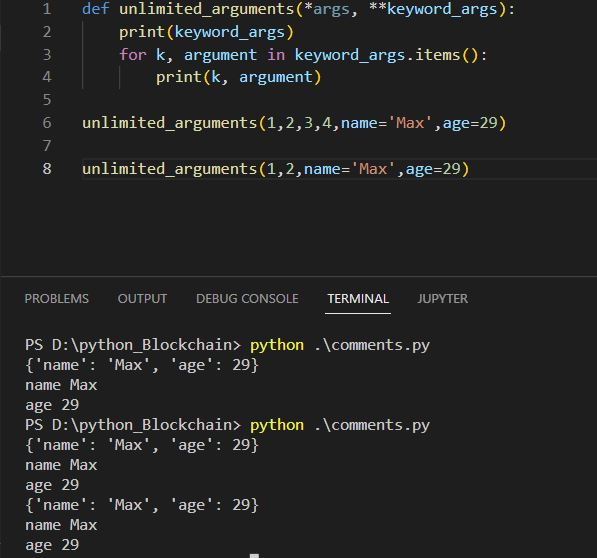
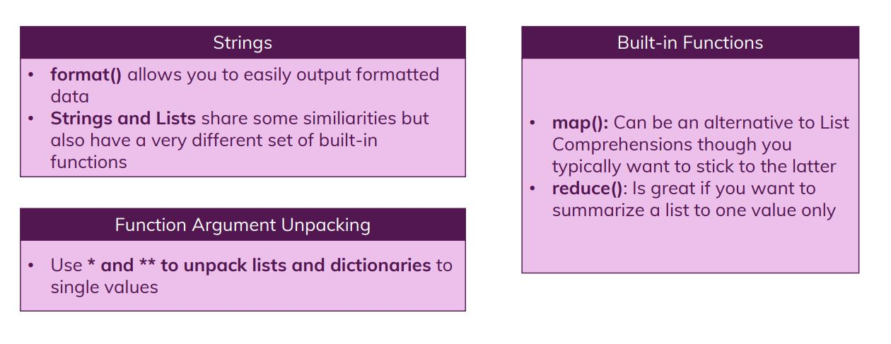
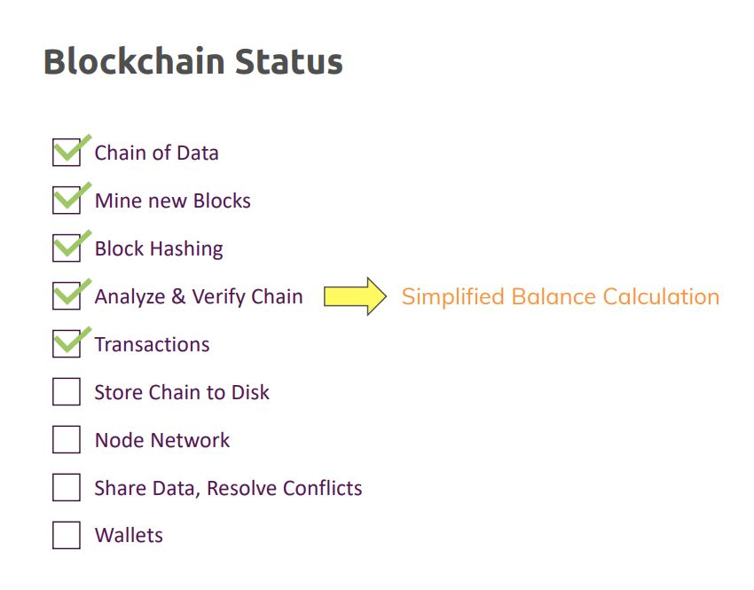

# More on Functions and Strings: Digging Deeper

## Module Overview

## What about Blockchain

## Comparing Strings and Lists

## Understanding the format method

## Escaping Character

## Formatting strings with f

## Adding string formatting to our project

change the print method is if not verify_chain() block

Refer to **blockchain1.py** file

## Understanding Map function

## Working with lambda function

## Reducing lists

We make changes in **get_balance()**

Refer to **blockchain2.py** file

## Unpacking function arguments

## Module Summary

## Refer to **blockchain_final_module.py** file for the implemented code in this module

## Useful Resources & Links

•	More on format() : https://docs.python.org/3.4/library/functions.html#format
•	More on the Python format()  Mini-Language: https://docs.python.org/3.4/library/string.html#formatspec
•	Python Lambda Functions: https://docs.python.org/3/tutorial/controlflow.html#lambda-expressions
•	map() : https://docs.python.org/3/library/functions.html#map
•	reduce() : https://docs.python.org/3/library/functools.html#functools.reduce

