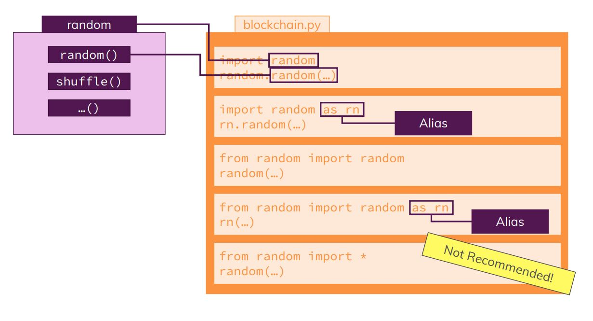

# Python Standard Library

## Module Overview

## What about Blockchain

## Python standard library

Google for python standard library and find out the rich set of library functions available in python

**import** statement is used in the code, to include the feature of the package in your implementation.

## importing packages

## importing hashlib to create a unique hash

In the function hash_block(), we are generating the pseudo hash, we write the code for generating real hash

We will **import hashlib** to create hashes, instead of returning custom hash we give a call to SHA256 algorithm in hashlib, The value we pass is a block which is a dictionary which needs to be converted to string, so to convert string we **import json** package.

Refer to the **blockchain1.py file**, run it and check the hash generated

## Using other import syntax

