# Working with Files: Because Data Shouldnot always be discarded

## Module Overview

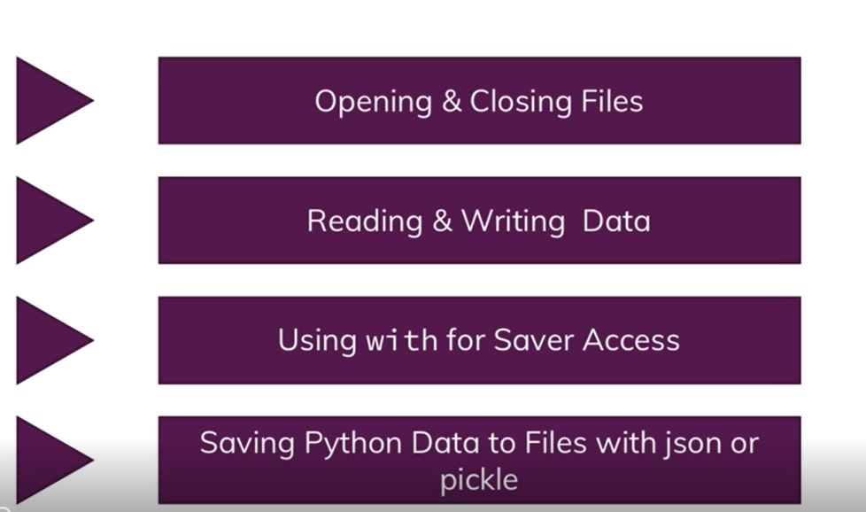

## What about Blockchain

## Handling File access 

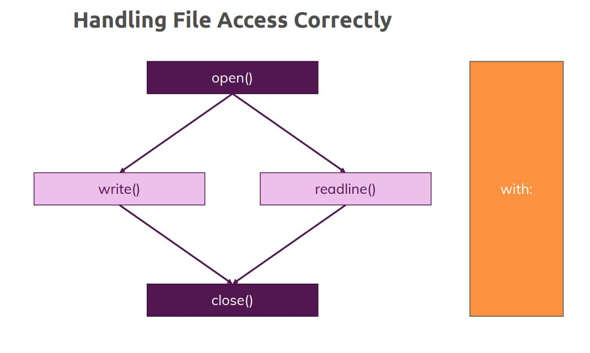

Always make sure to close the File object.

## Reading data from file

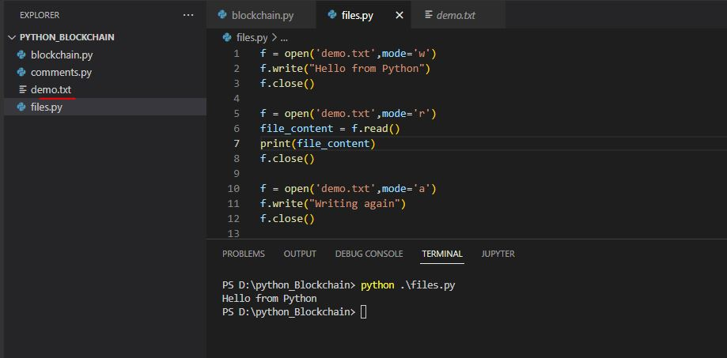

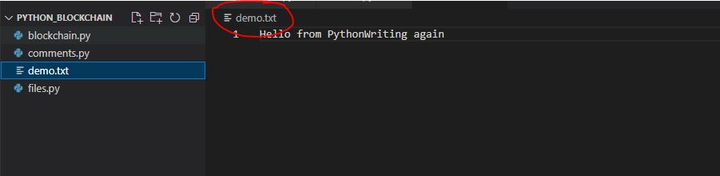

## Reading multi line content

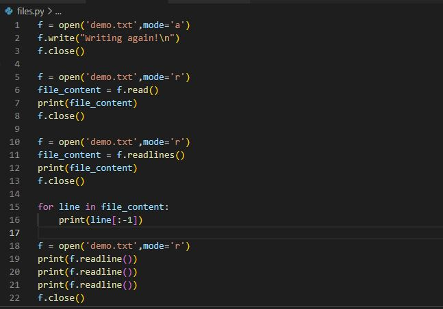

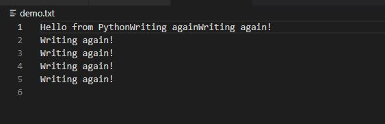

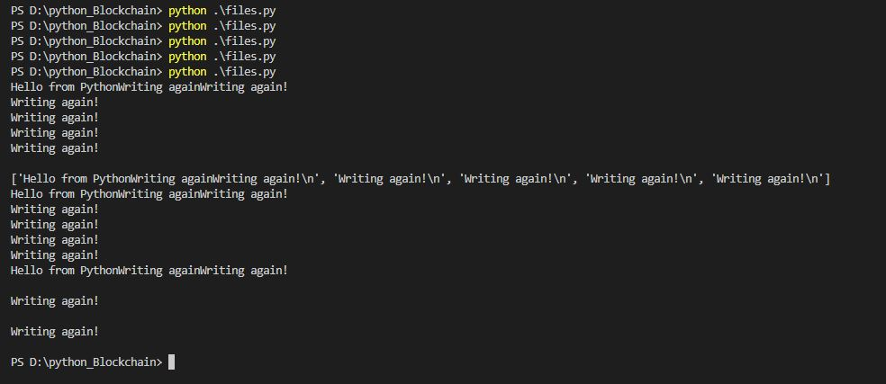

Refer to **files.py** for the code

## Using the with block statement

Refer to **withstatement.py** for the code

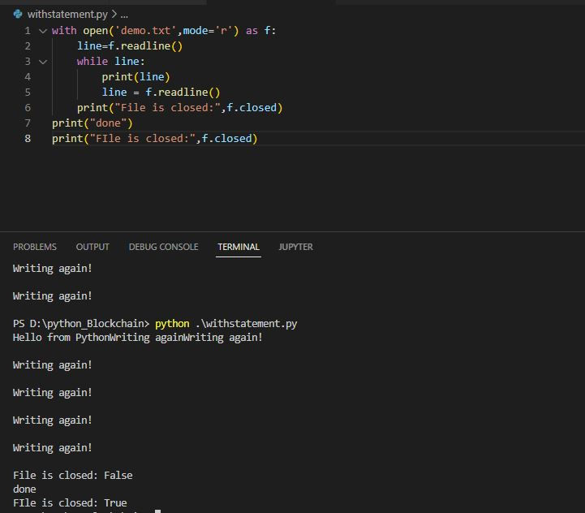

## Adding file access to our blockchain

Refer to **blockchain1.py** file

Code changes are in the new function **save_data()** , this function is called when weare adding new transactions and also when mining a new block. For the write menthod we need to typecast to str, as parameters are list. 

New function **load_data()** , the data read from this has to be initialzed to our blockchain list and open_transactions data. also decalre blockchain and open_transactions as **global variable**. 

## Convertng strings into python objects

Refer to **blockcahin2.py**

We need to import json, We make changes in **save_data()** using **json.dumps** for blockchain and open_transaction.

In **load_data()** use json libraray to deserialize the string, Takes string in json format and gives back python object. 

Also we use list comprehension 

## Storing data with Pickle

Refer to **blockchain3.py**

Refer to **save_data()** and **load_data()** 

## Comparing pickle and json

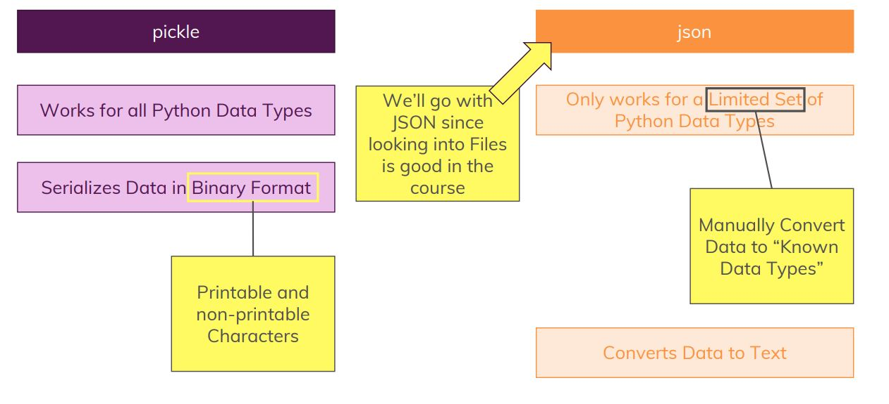

Changing it to back to json

Proper error handling should be taken care

## Module Summary

Refer to **blockchain_final_code.py** file

### Summary:

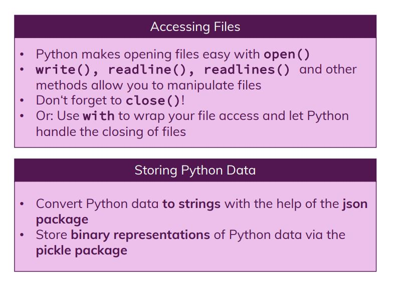

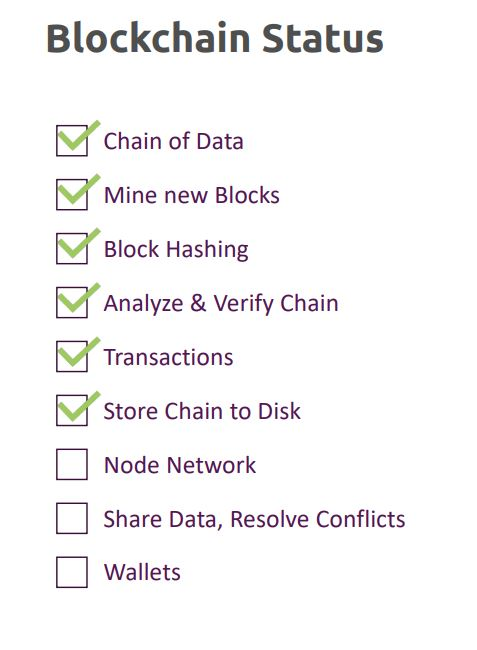

## Useful Links

•	Reading and Writing Files: https://docs.python.org/3/tutorial/inputoutput.html#reading-and-writing-files

•	More on the json Package: https://docs.python.org/3/library/json.html

•	More on the pickle Package: https://docs.python.org/3/library/pickle.html

