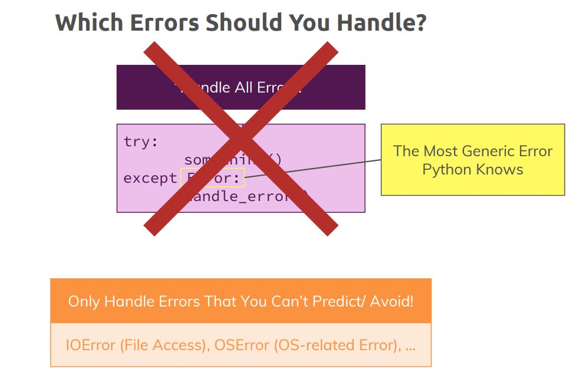
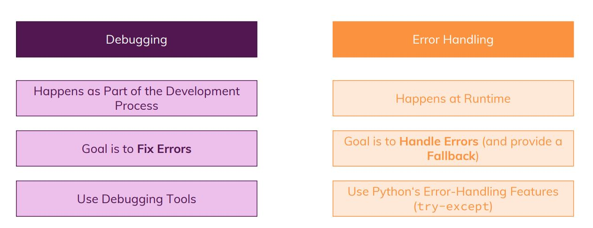
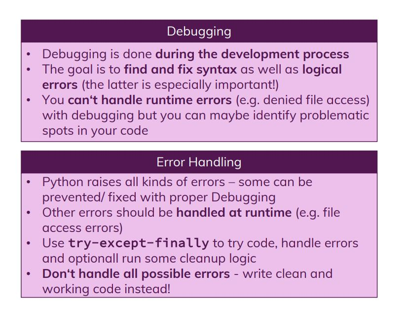

# Errors and Debugging

We need to handle Errors through Debugging, cause things dont go as planned

We will discuss about Debugging Vs Error handling

Use Debugging Tools in VS

Handle errors correctly

In Blockchain, We Ensure Save File Access

## Finding logical errors with debugger

We can debug the code using print() statements but its not the ideal solution to do so.

We have to use some official debugging tools

https://code.visualstudio.com/docs/python/debugging

Fix runtime errors with Exception Handling

## Which errors you should handle

## Debugging vs Error Handling

## Module Summary

## Handling Empty File Errors

Currently, there's one type of error, we're not yet handling in our blockchain - we'll do so later in the course though: Empty files.
What happens if you have a blockchain.txt  file BUT it is empty? This will cause an IndexError  and crash your program!
Handling it is easy though, you simply handle it together with the IOError :
except (IOError, IndexError): 

## Section code

Access the code in the **Section_Final_code** folder

## Useful Links

•	Debugging Python in Visual Studio Code: https://code.visualstudio.com/docs/python/debugging

•	More on try-except: https://docs.python.org/3/tutorial/errors.html

