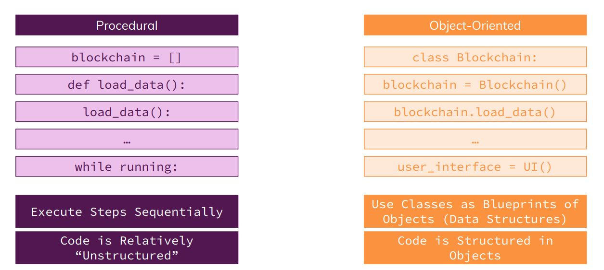
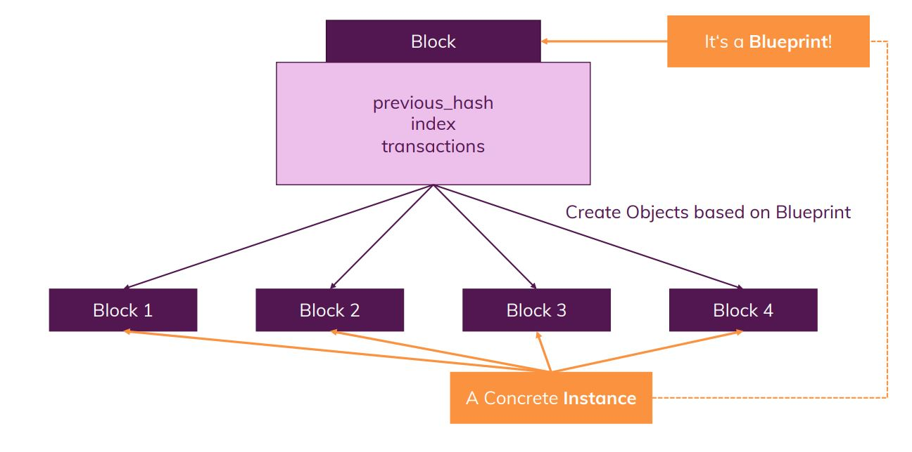
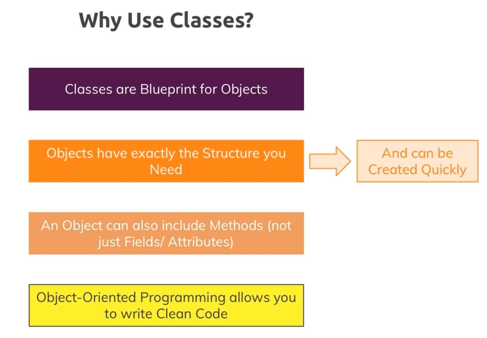
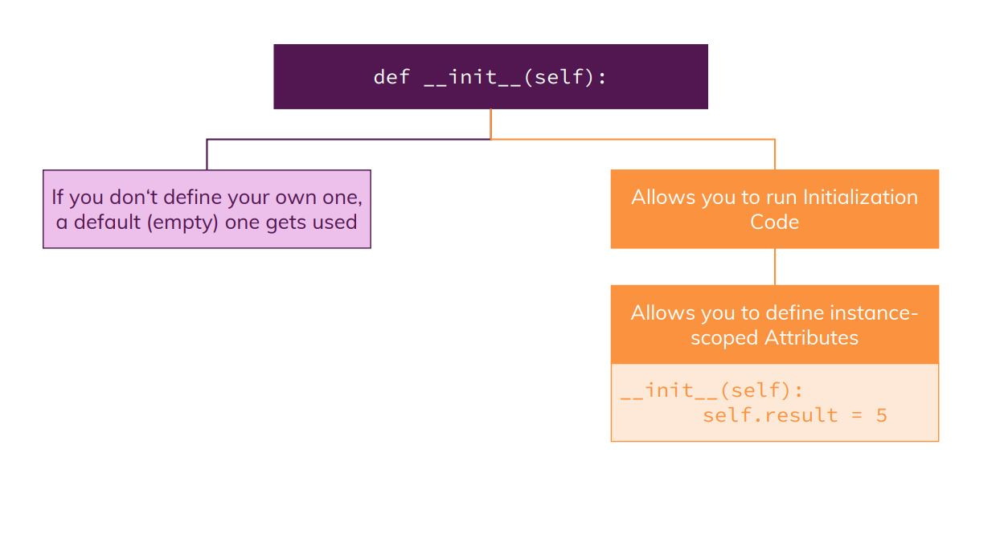
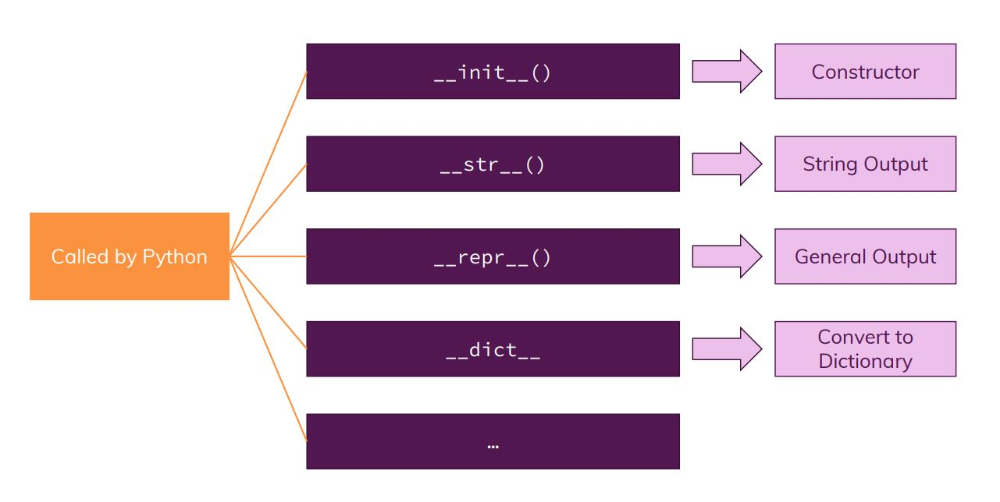
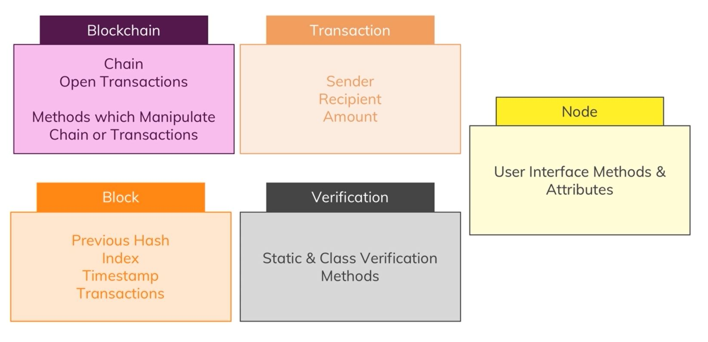
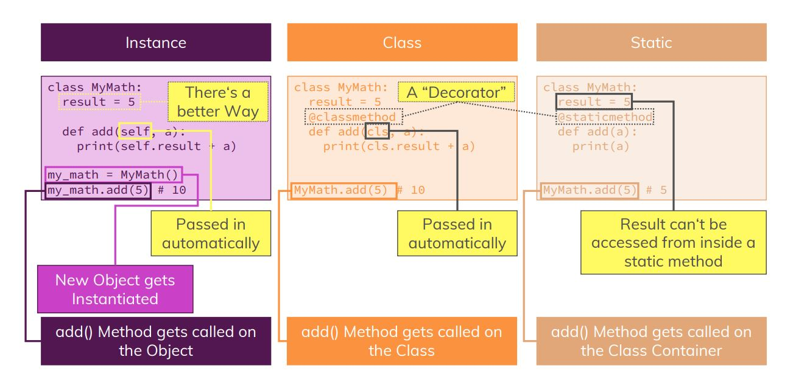
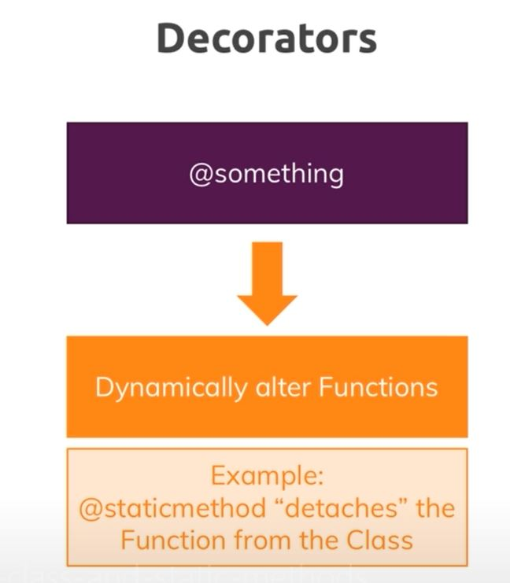
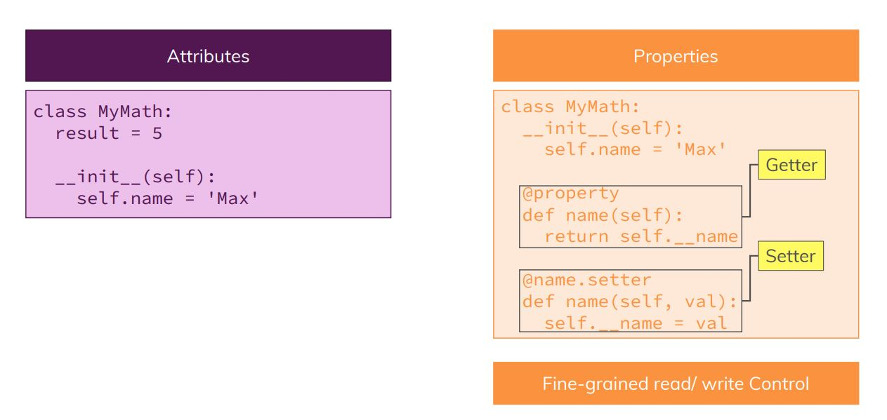
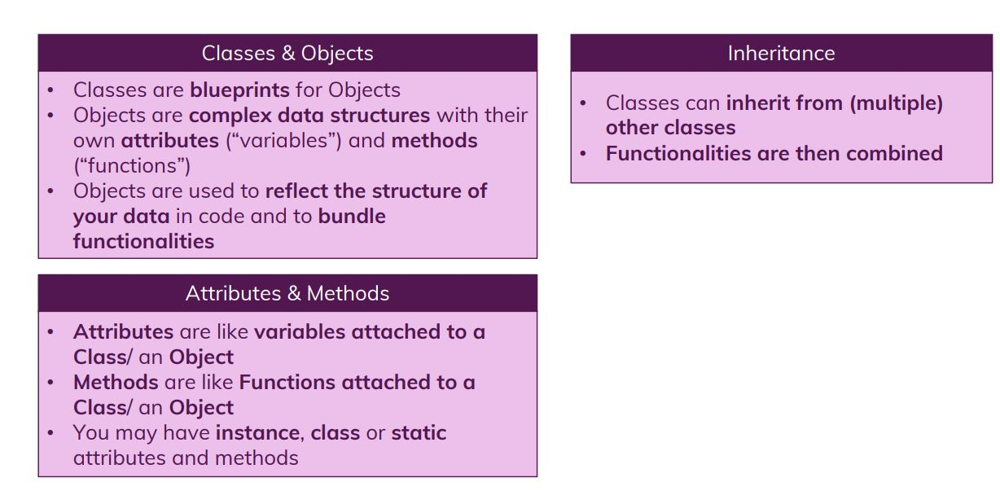

# Object Oriented Programming

## Module Overview

Classes and Objects, Attributes and Methods, Inheritance

Blockchain: Cleaner structure with Objects

## What is Object-Oriented Programming

## Understanding classes

## Creating a class

Refer to **car1.py**

## Classes vs instances Vs Dictionaries

## Understanding class attributes

Refer to **car2.py**

## Constructor and instance attributes

Refer to **car3.py**

## printing classes with special methods

Refer to **car4.py**

## Private and public attributes

Refer to **car5.py**

## Understanding Inheritance

Refer to **car6.py**

## Planning Blockchain classes

## Adding classes to blockchain

We create a **block.py** that will have a class Block, with constructor.

We save custom class object via json

We create transaction.py that will have a class Transaction, with constructor

We create verificaion.py file that will have a verification class

We initialize the node class, which is a user interface class

We create a Blockchain class

## Instance vs Class Vs Static Methods and attributes

## Attributes vs Properties

## Module Summary

## Final Section code

Refer to completed code in **Final_Section_code folder**

## Useful Links

•	Docstring Examples: http://sphinxcontrib-napoleon.readthedocs.io/en/latest/example_google.html
•	Python Special Methods: https://docs.python.org/3/reference/datamodel.html#basic-customization

