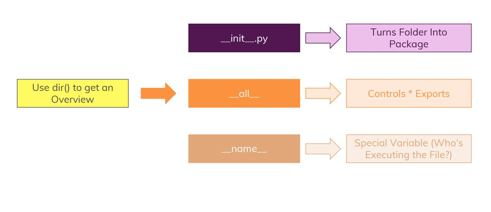
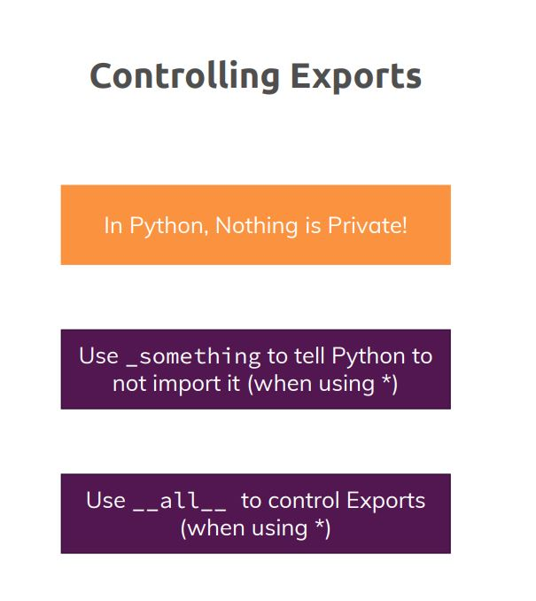
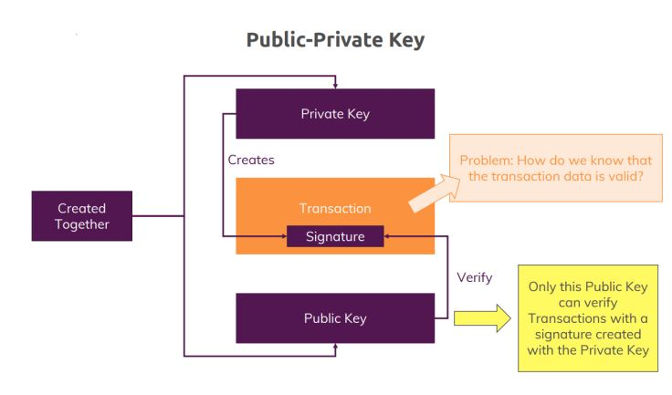
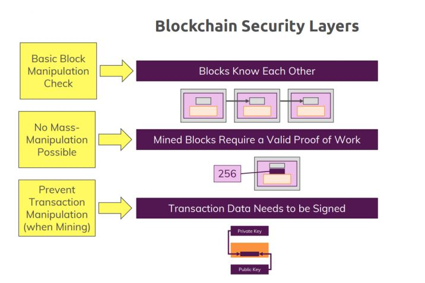
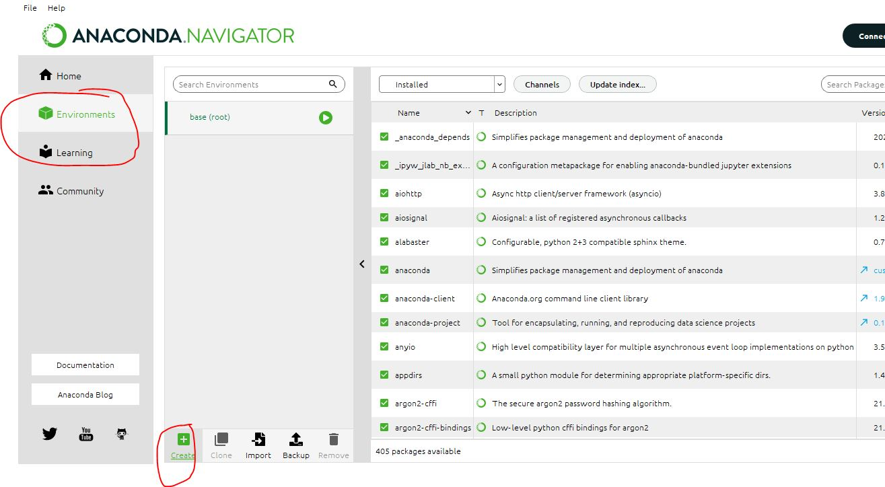
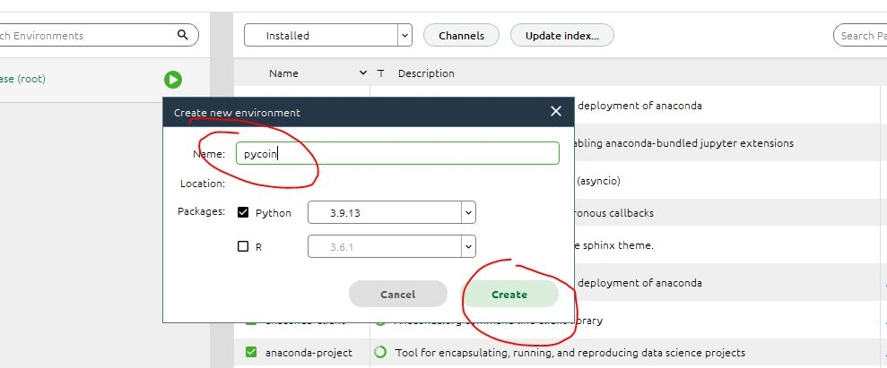
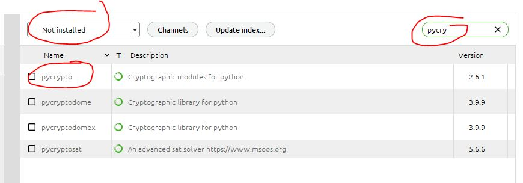
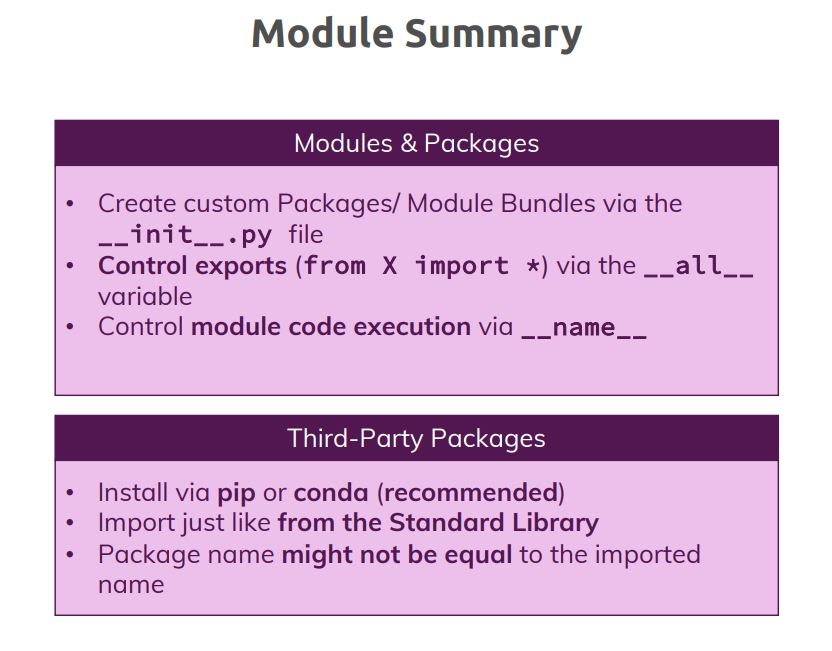
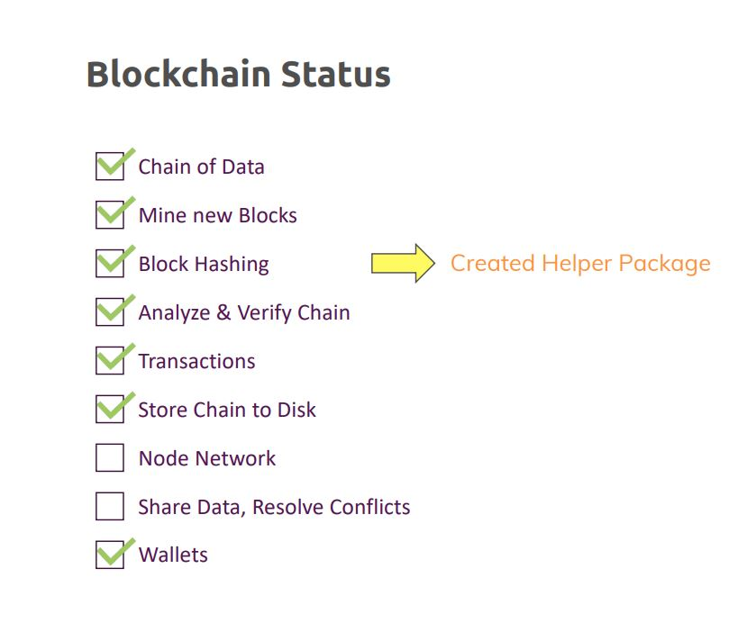

# Working with Modules and Third-party Packages: Splitting up Responsibilities

We create Custom module bundles, Advanced module operations, Installing and using Third-Party Packages

For Blockchain: We add a basic wallet

## Creating packages module bundles

We create a helper package

Understand module docstring

Understand how to control what can be exported

Execution and context name variable: __name__

Transaction signing

Why we need private public key transaction protection:

### Using anaconda to install third party package

Install the python package using terminal

pip install pycrypto

python -m pip install pycrypto

Install the package as shown in figure

Activate the python package environment in VS.

run the coomands

source activate python

or 

activate python

### Generating keys with third party package

Remember to run your project in the new Environment you have created.

Create a **Wallet.py** file

### Connecting node and wallet

### Generating keys on the node

### Saving and loading keys to files

### Creating transaction signatures

### add signature to transactions

### verify signatures

### Improve verification logic

### Summary

Refer to the **Section_Final_code** for the complete code 

### Use Pycryptodome instead of Pycrypto

### Using Virtual Environments

### Useful_Links

